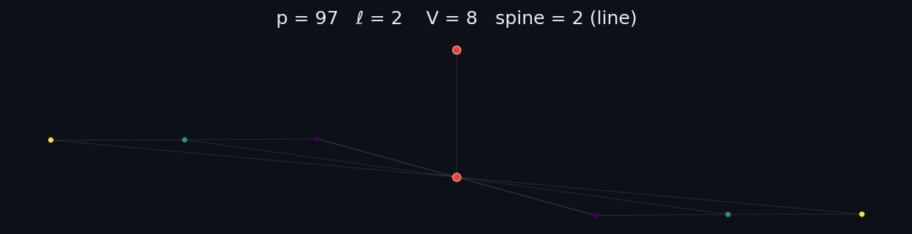

# ssi — Supersingular Isogeny Graphs

Static, force-directed visualizations of supersingular **ℓ-isogeny graphs** over
𝔽_p², built on [anvaka](https://github.com/anvaka)'s graph stack and published to
GitHub Pages.

**Live gallery:** https://hwangarau.github.io/ssi/



## What it shows

Each graph has ~p/12 vertices (the supersingular j-invariants in characteristic p)
and is (ℓ+1)-regular. We highlight the **spine** — the vertices whose j-invariant
lies in 𝔽_p — and shade every other vertex by its graph distance to the nearest
spine vertex.

- **Spine** (j ∈ 𝔽_p): red.
- **Non-spine** (j ∈ 𝔽_p² \ 𝔽_p): shaded by distance to the spine (viridis).

## Data

The [Isogeny Database](https://zenodo.org/records/4304044) (Florit & Finol,
ODC-BY), characteristics up to 30000, degrees ℓ ∈ {2,3,5,7,11}. Layout of each
prime's folder:

```
graphs/<p>/<p>_<l>.npz        scipy CSR adjacency (multiplicities, out-regular, directed)
graphs/<p>/<p>_nodes.txt      one j-invariant per line; line k = vertex k
graphs/<p>/<p>_metadata.json  nodes, spine count, per-ℓ diameters, minpoly
```

A `nodes.txt` line that is a plain integer is in 𝔽_p (spine); a line `a*z + b` is in
𝔽_p² (non-spine), where `z` is a root of the metadata `minpoly`.

## Spine layout

The induced spine subgraph is placed deterministically and pinned, in one of three
shapes, then non-spine vertices are seeded on concentric shells by distance to the
spine and lightly relaxed with `ngraph.forcelayout`:

- **ring** — no spine-spine edges: spine spread evenly on a circle.
- **line** — spine is a single path: stacked vertically down the centre.
- **generic** — otherwise: spine on a circle with chords.

## Pipeline

```
scripts/preprocess.py     .npz + nodes.txt -> docs/data/<p>_<l>.json
                          (symmetrize, spine flags, multi-source Dijkstra to spine,
                           spine classification, per-distance histogram)
scripts/layout.js         ngraph.forcelayout (anvaka) -> node positions in the JSON
scripts/build_manifest.py -> docs/manifest.json (index for the picker)
scripts/render.py         optional: matplotlib -> docs/img/<p>_<l>.png (static export)
```

The site (`docs/index.html` + `docs/app.js`) is an interactive picker: choose a prime
and ℓ, and the graph is drawn on a `<canvas>` from its JSON, with the count of
vertices at each distance to the spine.

### Run

```bash
npm install
# process specific graphs (or omit args to do all of graphs/*/*.npz)
python scripts/preprocess.py graphs/97/97_2.npz graphs/4001/4001_3.npz
node   scripts/layout.js          # lays out every docs/data/*.json
python scripts/build_manifest.py  # refresh the picker index
```

Requires Python (numpy, scipy, matplotlib) and Node. The raw dataset (`graphs/`,
the source `.zip`) is git-ignored; download it from Zenodo.
